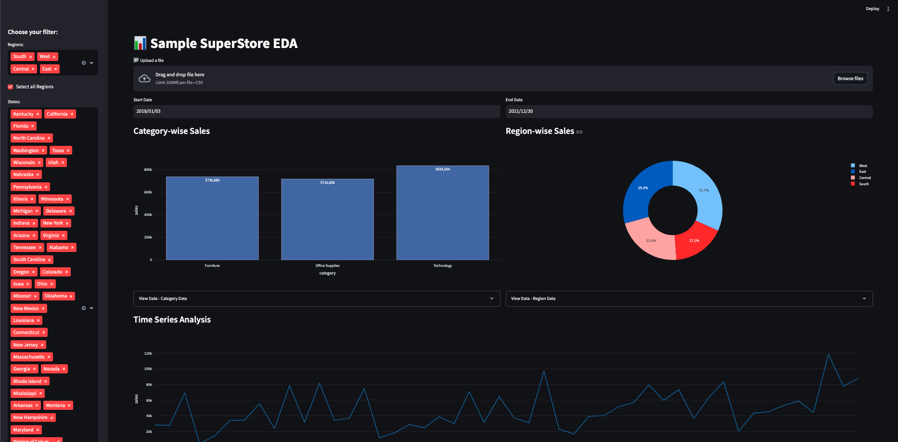

# Superstore Dashboard - Streamlit App

This repository contains a Streamlit application designed to visualize and analyze Superstore data. The dashboard provides interactive charts, filters, and insights into sales, profits, and other key metrics.

## Features
- Interactive visualizations for sales, profit, and categories.
- Filter options for regions, time periods, and product categories.
- Dynamic and responsive UI using Streamlit.

## Prerequisites
1. Python (3.7+ recommended) and Peotry.
2. Install the required Python libraries by running:
   ```bash
   poetry install
   ```

## How to Run
1. Clone this repository:
  
2. Run the Streamlit app:
   ```
   streamlit run dashboard.py
   ```

## App Preview
Below is a snapshot of the app:



## License
This project is licensed under the MIT License.
